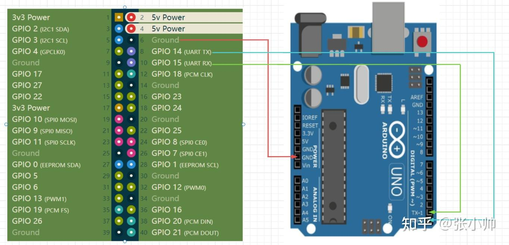

# 部署及使用文档

## 后端AI处理部分
需要Atlas200I DK
```python3 face_detaction main.py```

## 前端Web控制页面
任意设备均可, 例如Windows个人PC
```
cd live_robot
npm install
npm run dev
```

注意前后端的网络连通性

## Arduino云台控制
通过UART串口和Atlas200I DK正确连接后, 编译并烧录程序`sketch\sketch_dec4a\sketch_dec4a.ino`


UART连接参考


注意串口波特率设置为115200